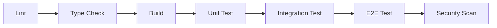

# Claude Code 스킬 가이드

이 문서는 프로젝트에 맞춤화된 Claude Code 스킬의 사용법과 설계 원칙을 설명한다.

---

## 개요

`.claude/skills/` 디렉토리에 7개의 프로젝트 전용 스킬이 정의되어 있다. 각 스킬은 반복적인 개발 작업을 표준화하며, 기존 프로젝트 문서(ADR, code-conventions 등)를 참조하여 일관된 패턴을 유지한다.

### 호출 방식

| 방식 | 설명 | 대상 스킬 |
|------|------|----------|
| **수동** | `/스킬명` 으로 직접 호출 | run-tests, gen-api-route, local-ci, db-migrate, security-scan |
| **자동** | Claude가 대화 맥락에서 자동 판단하여 실행 | gen-test, i18n-sync |

> 자동 호출 스킬도 `/스킬명` 으로 직접 호출할 수 있다.

---

## 스킬 상세

### 1. gen-test — 테스트 생성

ADR-007 전략에 따라 대상 파일에 맞는 테스트를 생성한다.

```
/gen-test [파일경로] [unit|integration|e2e]
```

**예시:**
```
/gen-test src/app/api/articles/route.ts
/gen-test src/components/article/ArticlePreview.tsx unit
/gen-test src/app/(browse)/[locale]/(home)/page.tsx e2e
```

**테스트 유형 자동 판단:**

| 대상 경로 | 유형 | 프레임워크 | DB 전략 |
|-----------|------|-----------|---------|
| `src/app/api/**` | unit | Jest | Prisma Client mocking |
| `src/validation/**` | unit | Jest | 불필요 |
| `src/utils/**` | unit | Jest | 불필요 |
| `src/actions/**` | unit | Jest | Prisma Client mocking |
| `src/components/**` | unit | Jest + RTL | 불필요 |
| `src/middlewares/**` | unit | Jest | 불필요 |
| `src/app/(browse)/**` | e2e | Playwright | Docker PostgreSQL + Seed |

**생성 규칙:**
- 파일 위치: `__tests__/{unit|integration|e2e}/` 하위
- 커버리지 60% 이상 목표 (ADR-007)
- Happy path + Error path 모두 포함
- 인증 필요 API는 인증/비인증 케이스 분리
- 소프트 삭제(`del: false`) 필터 검증 포함

**참조 문서:** `docs/adr/ADR-007.md`, `docs/code-conventions.md`

---

### 2. run-tests — 테스트 실행

테스트를 실행하고 결과를 요약 보고한다.

```
/run-tests [unit|integration|e2e|all] [--coverage]
```

**예시:**
```
/run-tests                  # 전체 테스트 실행
/run-tests unit --coverage  # 단위 테스트 + 커버리지
/run-tests e2e              # E2E 테스트만
```

**실행 명령 매핑:**

| 인자 | 실행 명령 |
|------|----------|
| `unit` | `npx jest --testPathPattern='__tests__/unit'` |
| `integration` | `npx jest --testPathPattern='__tests__/integration'` |
| `e2e` | `npx playwright test` |
| `all` | unit → integration → e2e 순차 실행 |
| `--coverage` | `npx jest --coverage` 추가 |

**보고 내용:** 통과/실패 수, 커버리지 퍼센트(60% 미만 시 경고), 실패 테스트 상세

**참조 문서:** `docs/adr/ADR-007.md`, `docs/adr/ADR-008.md`

---

### 3. gen-api-route — API 라우트 스캐폴딩

프로젝트의 표준 5단계 패턴에 맞는 새 API 라우트를 생성한다.

```
/gen-api-route [리소스명] [HTTP메서드]
```

**예시:**
```
/gen-api-route tags GET
/gen-api-route notifications GET,POST
/gen-api-route articles/[slug]/bookmark POST,DELETE
```

**표준 5단계 패턴:**

```
1. getCurrentUser()로 인증 확인 → ApiResponse.unauthorized()
2. Zod .safeParse()로 입력 검증 → ApiResponse.badRequest()
3. Prisma로 DB 조작
4. revalidatePath()로 캐시 무효화
5. ApiResponse.ok(data)로 응답
```

**생성 파일:**
- `src/app/api/{resource}/route.ts` — 메인 라우트
- `src/app/api/{resource}/[id]/route.ts` — 동적 세그먼트 (필요 시)
- `src/validation/schema.ts` — Zod 스키마 추가 (필요 시)

**참조 문서:** `docs/code-conventions.md`, `src/app/api/articles/route.ts` (예시)

---

### 4. local-ci — 로컬 CI 파이프라인

ADR-008 파이프라인을 푸시 전에 로컬에서 실행한다.

```
/local-ci [--fix] [--skip-tests]
```

**예시:**
```
/local-ci               # 전체 파이프라인 실행
/local-ci --fix          # lint 자동 수정 후 실행
/local-ci --skip-tests   # lint + type-check + build만 실행
```

**파이프라인 순서:**



| 단계 | 명령 | 실패 시 동작 |
|------|------|-------------|
| Lint | `npm run lint` | `--fix` 시 자동 수정 후 재검사 |
| Type Check | `npx tsc --noEmit` | 에러 목록 출력, 중단 |
| Build | `npm run build` | 빌드 에러 출력, 중단 |
| Unit Test | `npx jest --testPathPattern='__tests__/unit'` | 실패 상세 출력, 중단 |
| Integration Test | `npx jest --testPathPattern='__tests__/integration'` | Docker 미실행 시 건너뛰기 |
| E2E Test | `npx playwright test` | Playwright 미설치 시 건너뛰기 |
| Security | `npm audit --audit-level=high` | 취약점 목록 출력 |

**참조 문서:** `docs/adr/ADR-008.md`, `docs/code-conventions.md`

---

### 5. i18n-sync — 번역 키 동기화

`messages/en.json`과 `messages/zh.json` 간의 번역 키를 관리한다.

```
/i18n-sync [check|add|sync] [Namespace.key]
```

**예시:**
```
/i18n-sync check                        # 누락 키 탐지
/i18n-sync add Article.delete-confirm    # 새 키를 모든 로케일에 추가
/i18n-sync sync                          # 누락 키 자동 보충
```

**동작별 흐름:**

| 동작 | 설명 |
|------|------|
| `check` | 양쪽 JSON의 키 트리를 비교하여 누락 키 목록 보고 |
| `add` | 지정 키를 모든 로케일 파일에 추가. en 값은 사용자 입력, zh 값은 질문 |
| `sync` | 기준 로케일(en)에서 누락 키의 값을 복사하고 `[NEEDS_TRANSLATION]` 접두사 추가 |

**번역 파일 구조:**

```json
{
  "Namespace": {
    "key": "Translation value"
  }
}
```

네임스페이스: `Header`, `Home`, `Auth`, `Editor`, `Settings`, `Profile`, `Article`, `Footer`, `Misc`, `LocaleSelector`

**참조 문서:** `CLAUDE.md` "Internationalization" 섹션

---

### 6. db-migrate — DB 마이그레이션

Prisma 데이터베이스 마이그레이션 워크플로우를 실행한다.

```
/db-migrate [migrate|seed|reset|status]
```

**예시:**
```
/db-migrate status    # 마이그레이션 상태 확인
/db-migrate migrate   # 스키마 변경 → 마이그레이션 생성/적용
/db-migrate seed      # 시드 데이터 투입 (3명 사용자, 12+ 글)
/db-migrate reset     # DB 리셋 + 시드 (확인 필수)
```

**명령 매핑:**

| 동작 | 명령 |
|------|------|
| `status` | `npx prisma migrate status` |
| `migrate` | `npx prisma migrate dev --name {name}` |
| `seed` | `npm run seed` |
| `reset` | `npx prisma migrate reset` |

**주의 사항:**
- `reset`은 모든 데이터가 삭제되므로 반드시 사용자 확인 후 실행
- 소프트 삭제 필드(`del: Boolean @default(false)`) 유지 필수
- 테이블 매핑은 `@@map()` snake_case 패턴 준수

**참조 문서:** `prisma/schema.prisma`, `CLAUDE.md` "Database" 섹션

---

### 7. security-scan — 보안 스캔

ADR-008 기반으로 의존성 취약점과 시크릿 노출을 검사한다.

```
/security-scan [--full]
```

**예시:**
```
/security-scan         # 의존성 취약점 + 만료 패키지 검사
/security-scan --full  # 위 + 시크릿 노출 + .env 노출 + 하드코딩 검사
```

**스캔 항목:**

| 항목 | 기본 | --full |
|------|------|--------|
| npm 의존성 취약점 (`npm audit`) | O | O |
| 만료/비권장 패키지 (`npm outdated`) | O | O |
| 시크릿 노출 (소스코드 내 credential 패턴) | X | O |
| .env 파일 `.gitignore` 포함 여부 | X | O |
| 하드코딩된 인증정보 | X | O |

**참조 문서:** `docs/adr/ADR-008.md`, `CLAUDE.md` "Authentication" 섹션

---

## 설계 원칙

### 1. 기존 문서 참조

각 스킬은 상세 패턴을 자체적으로 정의하지 않고, 기존 프로젝트 문서를 참조한다:

| 스킬 | 주요 참조 문서 |
|------|--------------|
| gen-test, run-tests | ADR-007 (테스트 전략) |
| local-ci, security-scan | ADR-008 (CI/CD 전략) |
| gen-api-route | code-conventions.md (API 패턴) |
| i18n-sync | CLAUDE.md (i18n 아키텍처) |
| db-migrate | prisma/schema.prisma, CLAUDE.md |

### 2. SKILL.md 간결성

공식 문서 권고에 따라 SKILL.md는 핵심 지시만 포함하고 500줄 미만으로 유지한다. 상세 패턴, 예시, 컨벤션은 기존 프로젝트 문서에서 Read로 확인하는 방식이다.

### 3. 부수효과 기반 호출 제어

| 속성 | 값 | 의미 |
|------|-----|------|
| `disable-model-invocation: false` | 자동 호출 허용 | 읽기 전용 또는 파일 생성만 하는 스킬 |
| `disable-model-invocation: true` | 수동 호출만 | 명령 실행, DB 변경 등 부수효과가 있는 스킬 |

### 4. 프로젝트 전용 배치

모든 스킬은 `.claude/skills/`에 위치하여 Git으로 버전 관리되고, 팀원과 공유된다. 개인 환경(`~/.claude/skills/`)이 아닌 프로젝트 레포에 포함된다.

---

## 파일 구조

```
.claude/skills/
├── gen-test/
│   └── SKILL.md         # 테스트 생성
├── run-tests/
│   └── SKILL.md         # 테스트 실행
├── gen-api-route/
│   └── SKILL.md         # API 라우트 스캐폴딩
├── local-ci/
│   └── SKILL.md         # 로컬 CI 파이프라인
├── i18n-sync/
│   └── SKILL.md         # 번역 키 동기화
├── db-migrate/
│   └── SKILL.md         # DB 마이그레이션
├── security-scan/
│   └── SKILL.md         # 보안 스캔
├── openspec-explore/
│   └── SKILL.md         # OpenSpec 탐색 모드
├── openspec-propose/
│   └── SKILL.md         # OpenSpec 변경 제안
├── openspec-apply-change/
│   └── SKILL.md         # OpenSpec 구현
└── openspec-archive-change/
    └── SKILL.md         # OpenSpec 아카이브
```

---

## 관련 문서

- [ADR-007: 테스트 전략](adr/ADR-007.md)
- [ADR-008: CI/CD 전략](adr/ADR-008.md)
- [코드 컨벤션](code-conventions.md)
- [바이브 코딩 워크플로우](vibe-coding-workflow.md)
- [CLAUDE.md](../CLAUDE.md)
